C# Basics - Classes
===================

## Introduction

C# is an Object Oriented Programming (OOP) language.  It shares concepts with many other programming languages.  Classes are ways to model data.  The class is the general description, and an "instance" is a specific item that follows this model.  This is frequently used in applications to represent customers, products, orders, etc.

Before you start writing code, you need to understand the problem and how to solve it.  When using that approach, the code should be trivial.

The generic way to demonstrate classes is to create something like a "person" class with first name, last name, age, and other properties.  That's boring.  Let's use Pokémon and include some interesting statistics like name, type, level, and image.

The steps below will create a basic Windows Forms application.  It will contain a Pokémon class.  It will create some instances of the class and display them.

## Steps

1. Open Visual Studio and create a new Windows Forms application.  For details on how to do this, please see the [Creating a Basic Application](getting-started-with-dotnet.md) walkthrough.

    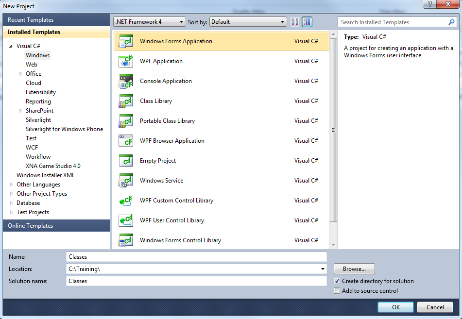
 
2. Set the Form's title text to "Classes".  Do you remember how to do this?  (Hint: check the properties window.)  This is also a good time to resize the form, as we will need some more space to display the information.

    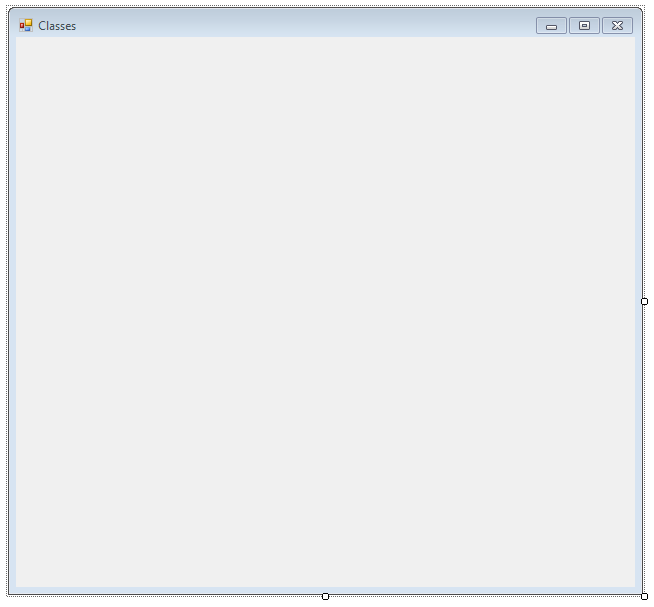
 
3. Next, add a ComboBox control, a Label control, a TextBox control, and a PictureBox control from the "Common Controls" section of the toolbox.  After the controls are added, set the following properties in the properties window.

	a. Set the Name of the ComboBox control to "cmbSelect".
	
	b. Set the Name of the TextBox to "txtInfo".
	
	c. Set the Multiline property of the TextBox to "True".
	
	d. Set the Text of the Label to "Select a Pokemon:".  The accent is difficult to get in there, so we will leave it out.
	
	e. Set the Name of the PictureBox to "picImage".
	
	It's a best practice to set the names of any controls you will reference in the code-behind.  Outside of theory, it makes it a lot easier to refer to a button as "submitButton" than as "button1", especially if you have multiple buttons.

4. Arrange the controls as in the screenshot below.  Also, feel free to customize the appearance, as explained in the [basic walkthrough](getting-started-with-dotnet.md).

    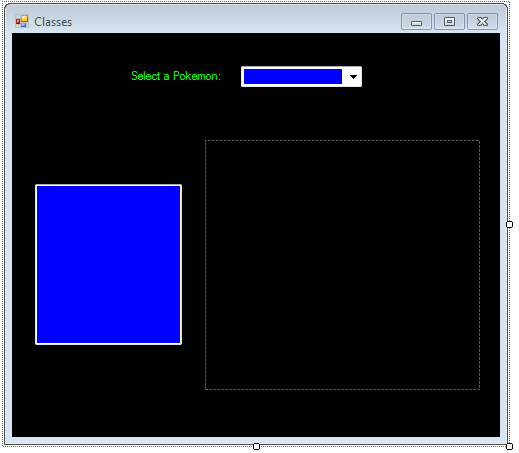

5. Let's add the items to the ComboBox control.  In the properties window, click on the [...] button next to Items.  Then enter the names of 4 Pokémon in the text box that appears.

	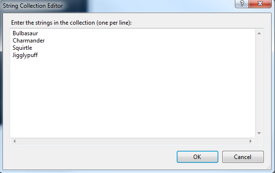
	
	Click OK.
 
6. We will add the functionality for the ComboBox's "SelectedIndexChanged" event in the code-behind.  In the properties window, click on the lightning bolt icon and double-click the "SelectedIndexChanged" entry.  This will generate the event handler.

	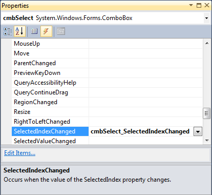
	
7. Let's leave that alone for a while, as we have to model the data and create instances first. 

	The first step is to add a new class to the project.  This will represent what a Pokémon is, not any particular one, but Pokémon in general.
	
	Right-click on the project in the Solution Explorer and choose Add > New Item.
	
	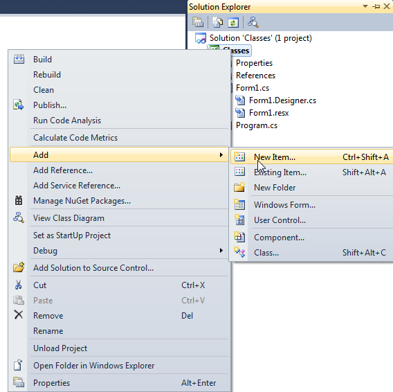
 
	Make sure that "Class" is selected, and name your class "Pokemon.cs".
	
	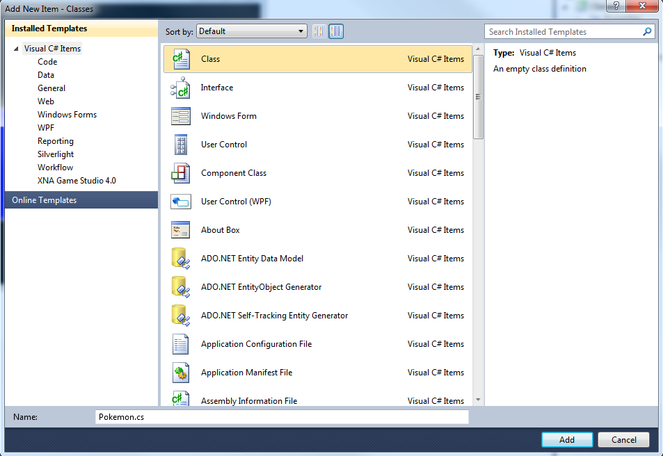
 
	Click "Add".

8. In the Pokemon class, let's define what statistics we will show about the Pokémon.  Let's show the name, type, level, and an image.

	a. First, add the following using statement to the top of the file so we can use the Image class.
	
	```
	using System.Drawing;
	```

	b. Inside the class, define the properties.  These are similar to [variables](variables.md).
	
	```
	// define what we know about each Pokemon
	private string name;
	private string type;
	private int level;
	private Image picture;
	```

9. Next, we will create a "constructor", which is a method that allows us to create instances of the class, namely, specific Pokémon.  This code is added inside the class, below the properties we just defined.

	```
	// constructor to allow us to create instances of Pokemon
    public Pokemon(string myName, string myType, int myLevel, Image myImage)
    {
        name = myName;
        type = myType;
        level = myLevel;
        picture = myImage;
    }
	```
 
	This sets the information that we know about each specific Pokémon.  When you create the class instance, you will specify the name, type, level, and image.
	
	Note that here, the names you give the arguments must be different from the names you gave the properties.  Otherwise you'd be trying to assign a property to itself (like `name = name`), which doesn't make sense.  One common practice is to have the class properties prefixed with `_`, but I'm not doing that here to keep it simple.

10.	Now we will create "getters" or "accessors", which allow us to find out the information about each Pokémon.  This is done for security reasons.  We could have made the properties public, but then anyone (and any program!) could go in there and change all of the information!  Like setting a level to 99!  This way we know it can only be read (not overwritten).  These are also [methods](methods.md). This code can be placed below the constructor code, but still inside the class.

	```
	public string GetName()
    {
        return name;
    }

    public string GetType()
    {
        return type;
    }

    public int GetLevel()
    {
        return level;
    }

    public Image GetImage()
    {
        return picture;
    }
	```

11.	Now we have our Pokemon class set up!

	Add the Pokémon images to the project.  You can use any source but I like [Bulbapedia](http://bulbapedia.bulbagarden.net/wiki/Main_Page).

	Paste the images into your project folder.
	
	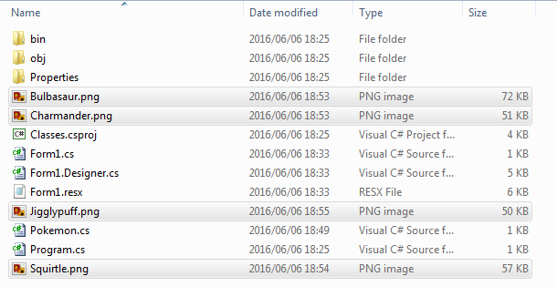

	Then add them to the project using the Solution Explorer.

	Right-click on the project and choose Add > Existing Item.

	Change the filter to "All Files".  Select all the images and click "Add".

	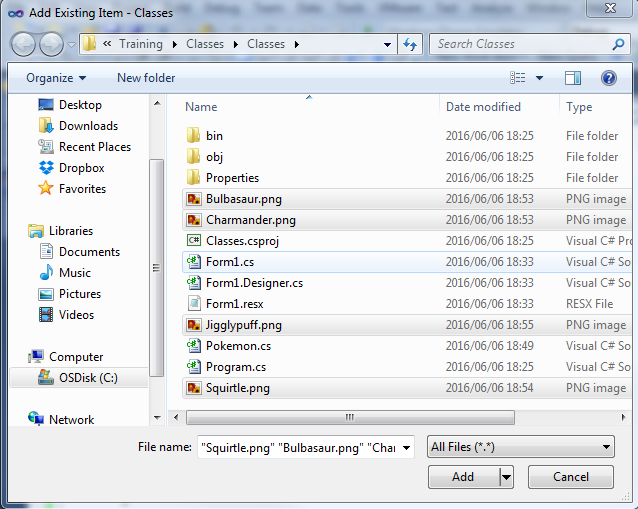
	
	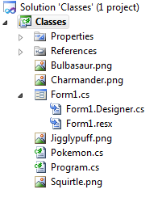

12. Now we get back to the ComboBox's event handler in Form1.cs.  Let's display the information for the Pokémon that was selected.

	```
	private void cmbSelect_SelectedIndexChanged(object sender, EventArgs e)
    {
        // Clear the textbox
        txtInfo.Text = "";

        // We will display information about a Pokemon, but we don't know which one yet
        Pokemon SelectedPokemon = new Pokemon("", "", 1, null);

        // Display the information based on the selection
        switch (cmbSelect.SelectedIndex)
        {
            case 0:
                SelectedPokemon = new Pokemon("Bulbasaur", "Grass", 5, Image.FromFile("../../Bulbasaur.png"));
                break;
            case 1:
                SelectedPokemon = new Pokemon("Charmander", "Fire", 5, Image.FromFile("../../Charmander.png"));
                break;
            case 2:
                SelectedPokemon = new Pokemon("Squirtle", "Water", 5, Image.FromFile("../../Squirtle.png"));
                break;
            default:
                SelectedPokemon = new Pokemon("Jigglypuff", "Normal", 10, Image.FromFile("../../Jigglypuff.png"));
                break;
        }
        txtInfo.Text = "Name: " + SelectedPokemon.GetName();
        txtInfo.Text += Environment.NewLine;
        txtInfo.Text += "Type: " + SelectedPokemon.GetType();
        txtInfo.Text += Environment.NewLine;
        txtInfo.Text += "Level: " + SelectedPokemon.GetLevel().ToString();
        picImage.Image = SelectedPokemon.GetImage();
    }
	```

	There is a lot of code, but the concept is simple.
	
	We clear the textbox, and create an instance of the Pokemon class to hold the Pokemon that we select.  However, at that time, we don't know which one it is yet.  That's why it's a blank placeholder.
	
	In the switch statement, we set the Pokemon instance to a new instance of the Pokemon class, based on the selected index of the ComboBox control.  The default case is just a recommendation for safety (in case something goes wrong in the program), but it's not required.  Here we use it to cover both case 3 (the last item in the combo box) as well as any unexpected input.
	
	Finally, we display the information using the "getters" of the class.  No matter which Pokemon was chosen, the correct information will display.
	
13. Save and run the project.  Select a Pokémon and see what happens!

	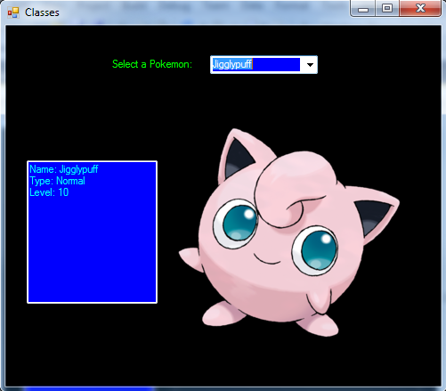
 
## Getters and Setters

There are special types of methods called "getters" and "setters", which are methods on classes to get or set property values.

There are scenarios where methods need to be accessed from different files and with different permission levels.  Methods can be set with the following access modifiers:

**Public** – Any part of the code can access this method.

**Private** – This method can only be accessed from this class.  

**Protected** – Like private, but also works in derived classes (advanced).

If I want to disallow certain parts of my code from running a method, I can set it to private.  If I want to allow any part of my code to run the method, I can set it to public.  The same can be applied to variables – you can set where they can be accessed from, so that they can't be changed unless you want them to be.  For more information on access modifiers, please view the [MSDN article](https://msdn.microsoft.com/en-us/library/ms173121.aspx).

The best example here is with classes, and needing to get or set a value of a property.  For example, if you have a class "Pokemon" and you want to get its level, you could either directly access a public property on the class, or you could write a "getter" method.

If you have a public property, then you can easily do something like this:

```
int currentLevel = myPokemon.level;
```

However, you could just as easily do something like this:

```
myPokemon.level = 99;
yourPokemon.level = 1;
```

That would be cheating!  Some things shouldn’t be changed without any control!  This could be malicious code that gets injected into the program, or it could be a coding mistake that the developer didn't notice.

The safer approach is to set the variable as private, and have 2 public methods to access the value of it or change it.  If you don't want something to be able to be set uncontrolled, you can skip the setter, and instead have a controlled way to change the value.

For example:

```
int currentLevel = myPokemon.getLevel();
myPokemon.levelUp();
```

Instead of being able to directly access the level property on the Pokemon class, you could freely get the level (read-only), but you can only level up a Pokemon.  This would increase the level by 1, and you can't decrease the level of the opponent's Pokemon at all.

The methods in the Pokemon class would look like this:

```
public int getLevel()
{
    return level; // assuming level is a property defined on the class
}

public void levelUp()
{
    if (level < 99)
    {
        level++;
    }
}
```

Remember that "void" means the method doesn't return anything.

The "level" property would be a **private** property, so that it can't be directly set through code outside the class (like `level = 99;`).
