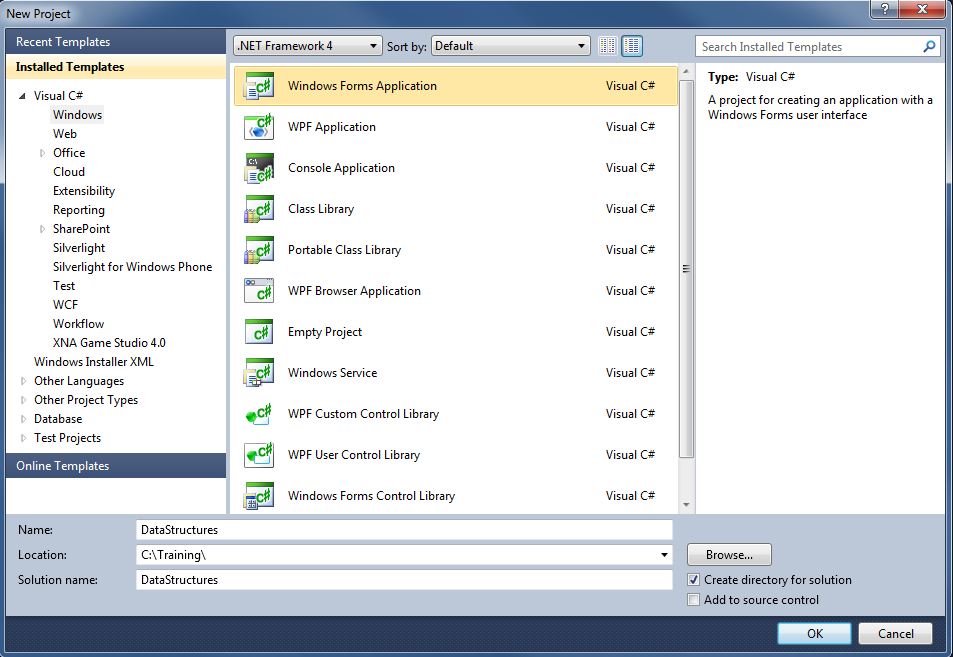
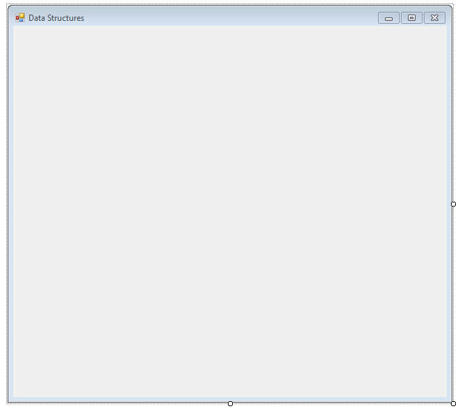
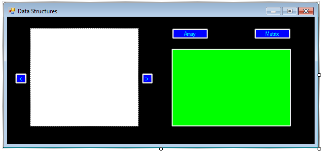
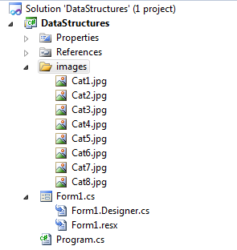
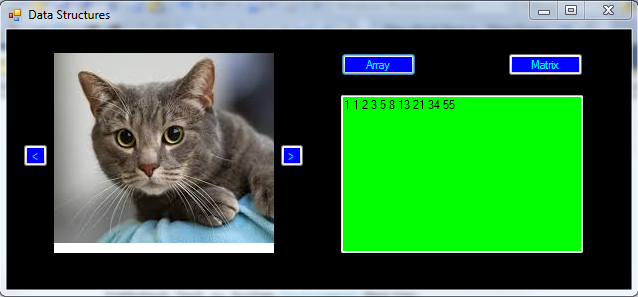

C# Basics - Data Structures
===========================

## Introduction

C# is an Object Oriented Programming (OOP) language.  It shares concepts with many other programming languages.  Data structures store information.  They are often the basis of modeling problems, and figuring out ways to solve them.

This walkthrough will cover two of the most common data structures – arrays and lists.  Matrices are an extension of arrays so they will be covered as well.

Arrays and lists are ways of storing the same type of data in a 1-dimensional structure.  It’s like a group of variables of the same type.  Instead of having to set each one as its own variable, you can set them in a group using only one variable.  To get or set a value, you specify the "index", meaning where in the group the value is.  For example, "The second value in the array should be 1".

Matrices are an extension of arrays in that they provide a way of storing the same type of data, but in a 2-dimensional structure.  Instead of using 1 index to specify the location of the value, you use 2 – one for the row and one for the column.  It's like a grid.  For example, you can set the value in row 2 and column 3.

In this walkthrough, you will create an array representing the first 10 numbers of the [Fibonacci sequence](http://en.wikipedia.org/wiki/Fibonacci_number).  You will also create a multiplication table using a matrix.  Finally, you will create an image viewer using a list.

Before you start writing code, you need to understand the problem and how to solve it.  When using that approach, the code should be trivial.  Data structures will help you with this methodology by helping to model the scenario.

## Steps

1. Open Visual Studio and create a new Windows Forms application.  For details on how to do this, please see the [Creating a Basic Application](getting-started-with-dotnet.md) walkthrough.

    
 
2. Set the Form's title text to "Data Structures".  Do you remember how to do this?  (Hint: check the properties window.)  This is also a good time to resize the form, as we will need some more space to display the information.

    
 
3. Next, add a PictureBox control, 4 Button controls, and a TextBox control from the "Common Controls" section of the toolbox.  After the controls are added, set the following properties in the properties window.

	a. Set the Name of the PictureBox control to "picCats".
	
	b. Set the Name of the TextBox to "txtOutput".
	
	c. Set the Multiline property of the TextBox to "True".

	d. Button controls should be placed on both sides of the PictureBox.  Their Name properties can be set to btnLeft and btnRight, and their Text properties can be set to "<" and ">".
	
	e. Two Button controls can be added above the TextBox.  Their Name properties can be set to btnArray and btnMatrix.  Their Text properties can be set to "Array" and "Matrix".
	
	It's a best practice to set the names of any controls you will reference in the code-behind.  Outside of theory, it makes it a lot easier to refer to a button as "submitButton" than as "button1", especially if you have multiple buttons.

4. Arrange the controls as in the screenshot below.  Also, feel free to customize the appearance, as explained in the [basic walkthrough](getting-started-with-dotnet.md).

    

5. We will set up the data structures in their own [methods](methods.md) in the Form's constructor.  Go to the code-behind (View > Code). 

6. First, we have to declare the data structures so we can use them in our program.  Add the following code above the Form constructor.

	```
	int[] fibonacci = new int[10];
    int[,] multiplication = new int[9, 9];
    List<Bitmap> cats;
	```
 
    This creates variables for our data.  The first is an array of numbers.  The second is a matrix of numbers.  The third is a list of images.  These data structures are initially empty, and we will provide the data later.
	
7. Add the following methods under the `InitializeComponent()` call.

	```
	InitializeArray();
	InitializeMatrix();
	InitializeList();
	```
	
	We will create these methods later, and until we do, they will be unrecognized by the editor and will cause errors if you try to build.

8. Let's start by writing the InitializeArray() method.  You can either right-click the method call and choose "Generate > Method Stub", or you can write out a simple method declaration.  For more information about methods, please see the [Methods](methods.md) walkthrough.

	```
	private void InitializeArray()
    {

    }
	```

9. We want to create an array of the first 10 numbers of the [Fibonacci sequence](http://en.wikipedia.org/wiki/Fibonacci_number).  Understanding the problem and how to solve it will make the code easy to write.  Think about how to create this array and then continue.

	We will set the first two numbers and then use a ["for" loop](if-statements-and-for-loops.md) to set the rest of the numbers.
	
	```
	private void InitializeArray()
    {
        fibonacci[0] = 1;
        fibonacci[1] = 1;
        for (int i = 2; i < 10; i++)
        {
            fibonacci[i] = fibonacci[i - 1] + fibonacci[i - 2];
        }
    }
	```

10.	Next we'll set up a matrix to display the multiplication tables for the numbers 1 to 9.  Create a method for InitializeMatrix() in the same way as you did for the array.  We don't have to initialize any values explicitly here.  Do you have an idea how to do this?

	We can use nested for loops to fill in the data.  Note the usage of the two indices to specify the row and the column in the matrix.
	
	```
	private void InitializeMatrix()
    {
        for (int row = 0; row < 9; row++)
        {
            for (int column = 0; column < 9; column++)
            {
                multiplication[row, column] = (row + 1) * (column + 1);
            }
        }
    }
	```

11.	Finally, we'll set up the list.  This will require getting some cat images from the internet.  Luckily, there is no shortage of them!  Add a new folder called "images" to the solution, then add the images inside that folder.  This can be done in the Solution Explorer.
	
	

12. Create the InitializeList() method.  The paths are relative.  `../` means "go up one folder level".  In this case, the application runs from an .exe file in the bin/Debug folder, so we have to go up 2 levels to reach the "images" folder.

	```
	private void InitializeList()
    {
        cats = new List<Bitmap>(8);
        cats.Add(new Bitmap("../../images/Cat1.jpg"));
        cats.Add(new Bitmap("../../images/Cat2.jpg"));
        cats.Add(new Bitmap("../../images/Cat3.jpg"));
        cats.Add(new Bitmap("../../images/Cat4.jpg"));
        cats.Add(new Bitmap("../../images/Cat5.jpg"));
        cats.Add(new Bitmap("../../images/Cat6.jpg"));
        cats.Add(new Bitmap("../../images/Cat7.jpg"));
        cats.Add(new Bitmap("../../images/Cat8.jpg"));

        picCats.Image = cats[0];
    }
	```
	
13. We also need to create a variable to track which image is being shown in the PictureBox.  Add it below the other variable declarations.

	```
	int catIndex = 0;
	```
	
14. Now we will add functionality to the buttons.  We'll start with the Array and Matrix buttons.

	a. Double-click the Array button to generate the button click event handler.
	
	b. Add code to display the array in the TextBox.  Clear the text, then use a "for" loop to print out the numbers in the array.
	
	```
	private void btnArray_Click(object sender, EventArgs e)
    {
        txtOutput.ResetText();
        for (int i = 0; i < fibonacci.Length; i++)
        {
            txtOutput.Text += fibonacci[i] + " ";
        }
    }
	```
 
	c. Double-click the Matrix button to generate the button click event handler.
	
	d. Add code to display the matrix in the TextBox.  This won't layout perfectly because the double-digit numbers take up more space.
	
	```
	private void btnMatrix_Click(object sender, EventArgs e)
    {
        txtOutput.ResetText();
        for (int i = 0; i < 9; i++)
        {
            for (int j = 0; j < 9; j++)
            {
                txtOutput.Text += multiplication[i, j] + " ";
            }
            txtOutput.Text += System.Environment.NewLine;
        }
    }
	```

15. Let's set up the < and > buttons for the PictureBox.

	a. Add code for the < button.  Make sure you handle the case where you're at the beginning of the List!
	
	```
	private void btnLeft_Click(object sender, EventArgs e)
    {
        if (catIndex != 0)
        {
            catIndex--;
        }
        else
        {
            catIndex = cats.Count - 1;
        }

        picCats.Image = cats[catIndex];
    }
	```
	
	You may want to use the modulo operator (`%`)  here, but it doesn't work with negative numbers.
 
	b. Add code for the > button.  Make sure you handle the case where you're at the end of the List!
	
	```
	private void btnRight_Click(object sender, EventArgs e)
    {
        catIndex = (catIndex + 1) % 8;
        picCats.Image = cats[catIndex];
    }
	```
	
	Modulo works here because the index does not go negative.

16. Save and run the project.

	a. You can use the < and > buttons to browse the pictures of cats.
	
	b. You can display the first 10 numbers in the Fibonacci sequence by clicking on the "Array" button.
	
	c. You can display a 9x9 multiplication table by clicking on the "Matrix" button.
	
	

 
## Notes

Arrays are very common, and matrices are used for multiple dimensions of data.

There are multiple ways to initialize arrays and matrices, as described [here](https://msdn.microsoft.com/en-us/library/aa287601%28v=vs.71%29.aspx) (MSDN).

Lists are a "generic" data structure, meaning that you specify the type of list, and all items must be that type.  For example, List<String> is a list of String objects.

The major difference between arrays and lists are how resizable they are.

With an array, you set a number of elements and that is how many elements there will be in the array.  If you want to add an extra item or remove an item, you have to create a new array.

With a list, you can add and remove items from the list using [Add and Remove methods](http://msdn.microsoft.com/en-us/library/6sh2ey19%28v=vs.110%29.aspx).

You can also use a [LinkedListNode](https://msdn.microsoft.com/en-us/library/ahf4c754.aspx) with a [LinkedList](http://msdn.microsoft.com/en-us/library/he2s3bh7.aspx) to move between items using the Previous and Next methods.

A challenge exercise would be to redo the List of cats as a LinkedList and allow the user to add or remove cat pictures, and navigate through them with the Previous and Next methods.

Lists and arrays both will throw an "IndexOutOfRange" exception if you try to access a value at an index that doesn't exist.  Be careful!  That is why you have to check for the ends of the List when implementing the < and > buttons.  This is a common error when learning these data structures, so don't get frustrated.  Also, remember that indexing starts from 0, so if you have 10 items in your array or list, index 10 doesn't exist – it's from 0 to 9!
