Basic Concepts for Visual Studio .NET and C#
============================================

## Introduction

Visual Studio .NET is an IDE (Integrated Development Environment) where developers create their applications and websites.  It’s like what Paint is for creating images, a place to start that gives you tools to make your job easier.

In this walkthrough, we'll cover the basic concepts for creating applications in C#.  C# and OOP (Object Oriented Programming) are out of the scope of this introductory lesson.  While an understanding of programming is not required to go over the basic concepts, it will help you to expand on the basic lesson.

The steps below will create a basic Windows Forms application.  It will have one form and one button.  When the button is clicked, it will show a message box.

## Steps

1. Open Visual Studio.  This example uses Visual Studio 2010, but any version can be used.  This can be found in the Start Menu > All Programs > Microsoft Visual Studio [version]> Microsoft Visual Studio [version].

    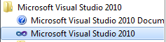
 
2. In Visual Studio, create a new application.  This can be done either through the "new project" link or through the File > New > Project menu option.

    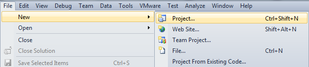
 
3. In the "New Project" window, select Windows Forms Application and choose the location.   You can also set the name of the project.

    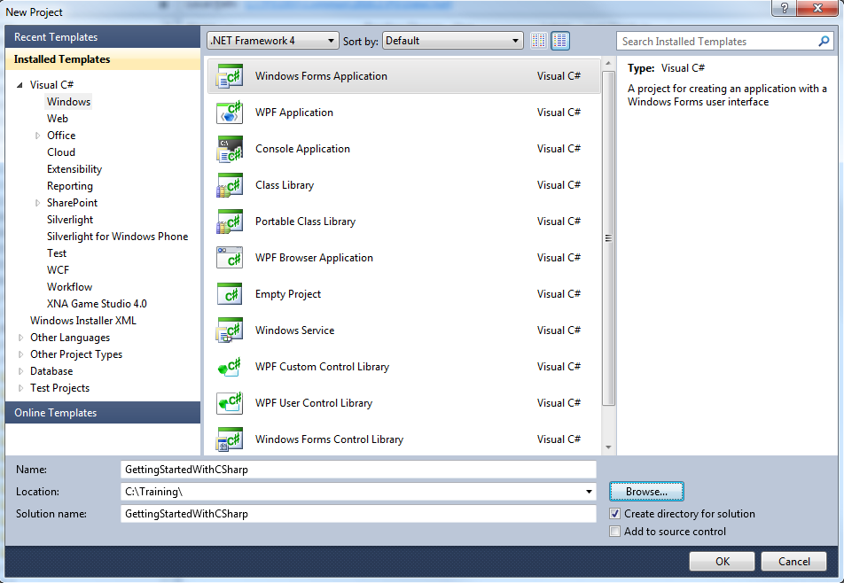
 
4. Visual Studio will create the project for you.  You should see something like this.

    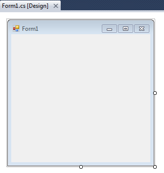

    This is your form.  This is where you will add visual elements to the application.

5. Let's set the form name using the Properties window.  Make sure that the form is selected, then right-click it and choose Properties.  You can also use the menu option View > Properties Window.  Then set the Text property to "Hello World".

    The Properties window is where you can make changes to the form, or anything on it.  It allows you to customize the elements.

    Visual Studio often provides "description text" for the properties.  If you don't know what something does by its name, there should be an explanation.

    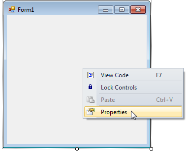

    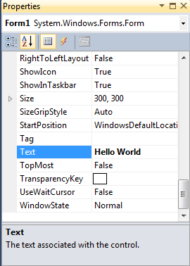

    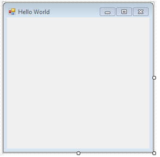
 
6. Next, add a button from the toolbox.  The Toolbox should be in a collapsed tab on the left side.  If you don't see it, go to View > Toolbox.

	The toolbox is where elements are stored.  You can add them to your form by double-clicking them, or dragging and dropping them.

    Custom controls, like the ones Infragistics offers, will also be added to the toolbox if the product is installed.

    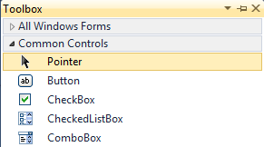 

    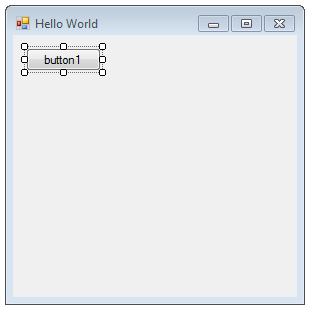
 
7. Drag the button to the center of the control.  Change the text of the button to "Click Me" using the Text property in the Properties Window.

    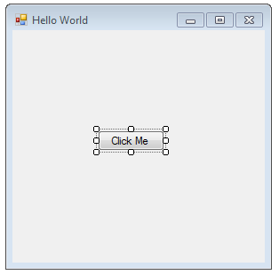
 
8. As you may have noticed, the default "battleship gray" is not very appealing.  Luckily, there are appearance properties that can be changed to make the application look better.  Try it out!  Experiment with the BackColor, ForeColor, and Font properties on both the form and the button.  If you change the font, you may have to resize the button, which you can do by dragging the edges.

    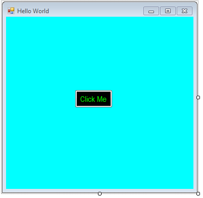

9. Finally, it's time to add some functionality to the button.  Double-click the button.  This will bring up what is called the "Code Behind".  The previous steps were done in the "Designer", which is visual and friendly to beginners.  The "Code Behind" is where the functionality is implemented.

	As you can see, an event handler was created for you by Visual Studio.

    ```csharp
    private void button1_Click(object sender, EventArgs e)
    {
    
    }
    ```

    An "event" is something that happens while an application is running.  It could be anything from text being entered, a button being clicked, the form getting resized, or even the application loading.  When something happens and you want to have a reaction to that, you can write it in an event handler.  Here we will handle the button's Click event and show a message box.

	Enter the following code into the event handler.

    ```csharp
    MessageBox.Show("Hello World!", "Message");
    ```

    It should look like this:

    ```csharp
    private void button1_Click(object sender, EventArgs e)
    {
        MessageBox.Show("Hello World!", "Message");
    }
    ```

10.	Save and run the project.  You can run the project either by clicking on the green arrow, or through the menu option Debug > Start Debugging.

    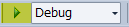

11.	You’ll see something very similar to the designer.  Try clicking on the button.  Looks what happens!

    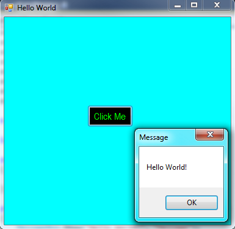 

That’s it!  That's your first application.  "Hello World" is a common first step in learning a new programming language.  Hopefully this helped to introduce you to C#, Visual Studio .NET, and the general concept of applications.
