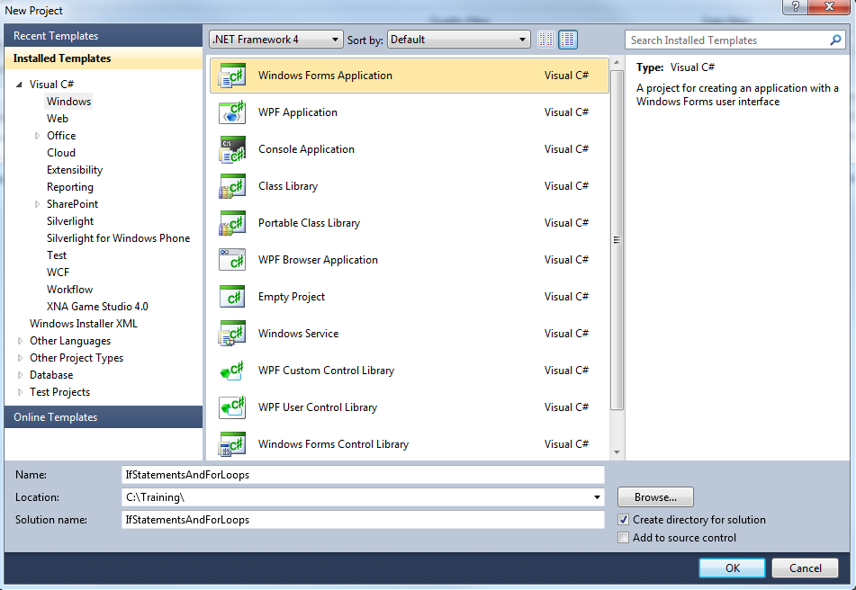
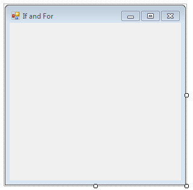
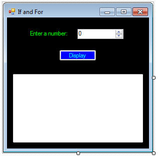
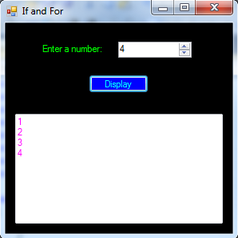
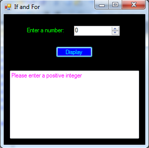

C# Basics - If Statements and For Loops
=======================================

## Introduction

C# is an Object Oriented Programming (OOP) language.  It shares concepts with many other programming languages.  Two basic concepts are "if" statements and "for" loops.  An "if" statement does an action if a certain condition is met.  This allows for code to execute only in situations that are valid, or that require it.  A "for" loop does an action a specified number of times.  This allows you to do the same thing, or similar things, over and over again without writing the same code multiple times.

A "while" loop is similar to a "for" loop.  It runs the same code as long as a certain condition is met.  It's like an "if" statement, but multiple times.  For example, you could prompt the user to enter valid input until valid input is supplied.

There is also a "switch" statement, which is like multiple "if" statements based on different values of the same condition.

The "if", "for", "while" and "switch" concepts can all be grouped as program "logic".  They control execution of code based on conditions.

Before you start writing code, you need to understand the problem and how to solve it.  When using that approach, the code should be trivial.

The steps below will create a basic Windows Forms application.  It will ask for a number, and print out all of the numbers from 1 to that number.  It checks to make sure that the number is at least 1, otherwise it doesn’t make sense.  The "while" loop and "switch" statement are explained as alternatives to the "for" loop and "if" statement in the challenge section.

## Steps

1. Open Visual Studio and create a new Windows Forms application.  For details on how to do this, please see the [Creating a Basic Application](getting-started-with-dotnet.md) walkthrough.

    
 
2. Set the Form's title text to "If and For".  Do you remember how to do this?  (Hint: check the properties window.)

    
 
3. Next, add a NumericUpDown control, a Label control, a Button control, and a TextBox control from the “Common Controls” section of the toolbox.  After the controls are added, set the following properties in the properties window.

	a. Set the Name of the NumericUpDown control to "numMaximum".
	
	b. Set the Name of the Button to "btnDisplay".
	
	c. Set the Text of the Button to "Display".
	
	d. Set the Text of the Label to "Enter a number:".
	
	e. Set the Name of the TextBox to "txtResult".
	
	f. Set the Multiline property of the TextBox to "true".

	It's a best practice to set the names of any controls you will reference in the code-behind.  Outside of theory, it makes it a lot easier to refer to a button as "submitButton" than as "button1", especially if you have multiple buttons.

4. Arrange the controls as in the screenshot below.  Also, feel free to customize the appearance, as explained in the [basic walkthrough](getting-started-with-dotnet.md).

    

5. We will add the functionality for the button click in the code-behind.  Double-click the button to generate the event handler.

	```csharp
	private void btnDisplay_Click(object sender, EventArgs e)
	{
	
	}
	```
 
6. The goal is to display all of the numbers between 1 and the entered number.  How do we do that? 

	Let's start by getting the value entered.  If you need a hint, check the [Variables](variables.md) walkthrough.  This code goes inside the button click event handler.
	
	```csharp
	int value = (int) numMaximum.Value;
	```
 
	We're simply casting the decimal value from the NumericUpDown control to an integer, to make it easier to work with later.
 
7. Next we have to check that the value entered is greater than 0.  This is where the "if" statement is helpful.  The basic structure is:

	```
	if ([variable] [operator] [value for comparison])
	{
	// code to execute if the statement is true
	}
	else
	{
	// code to execute if the statement is false
	}
	```

	So let's make sure that the value entered is greater than 0.

	```csharp
	// check that the value entered is greater than 0
	if (value > 0)
	{
	// add code here
	}
	else
	{
	// add code here
	}
	```

8. What should we do if the value is valid?  As we stated earlier, let’s display the values from 1 to that number.  This is where the "for" loop is helpful.  The basic structure is:

	```
	for ([declare and initialize variable], [continuation rule], [change])
	{
	// add code here
	}
	```

	The first argument creates a variable to effectively "count" the number of times to do the code.  The second argument tells the loop to stop if some condition is false.  The third argument changes the variable in some way that the loop will eventually stop.
	
	This will make more sense with the example for the walkthrough.  This code should go inside the "if" {}, because it is what will happen if the value entered is valid.

	```csharp
	for (int count = 1; count <= value; count++)
	{
	txtResult.Text += count.ToString() + Environment.NewLine;
	}
	```
 
	We’re creating a variable called "count" to set the current number we will display.  We'll continue displaying numbers as long as "count" is less than or equal to (`<=`) the "value", which is the number entered by the user.  Each time we display a number, we will increment count in order to display the next number.  `++` is shorthand for "add 1".  We could have written `count = count + 1` for the final argument, but `++` is neater.

	Inside the loop, it simply adds the number and a line break to the text box.
	
	What will happen?  Let's say the user entered the number 3.  The "count" will start at 1.  It checks if `1 <= 3`, and because it is, it will display that number on its own line.  Then the loop code is done, and it increments the value (because of `count++`).  Now "count" is 2.  It checks if `2 <= 3`, and because it is, it will display that number on its own line. Same is done with "count" at 3.  Once "count" goes to 4, it checks if `4 <= 3`, which it is not!  At this point, the "for" loop is done and its code does not execute anymore.

9. Now we need to do something if the input is not valid, like if the user enters 0 or a negative number.  Let's just display a reminder.

	```csharp
	else
	{
		txtResult.Text = "Please enter a positive integer";
	}
	```

10.	Finally, let's clean things up a bit by clearing the text box each time "Display" is clicked.  This code should go right before the "if" statement.

	```csharp
	// clear the text box
	txtResult.Text = "";
	```

11. For your reference, here is the full code of the button click event handler.

	```csharp
	private void btnDisplay_Click(object sender, EventArgs e)
    {
        int value = (int)numMaximum.Value;

		// clear the text box
        txtResult.Text = "";

        // check that the value entered is greater than 0
        if (value > 0)
        {
            for (int count = 1; count <= value; count++)
            {
                txtResult.Text += count.ToString() + Environment.NewLine;
            }
        }
        else
        {
            txtResult.Text = "Please enter a positive integer";
        }
    }
	```
	
12. Save and run the project.  Enter a positive integer and click "Display".

	
	
	
 
## Challenge

### While Loop

As mentioned in the introduction, a "while" loop can be used to accomplish the same thing as a "for" loop.

```
while ([variable] [comparison operator] [value])
{
// add code
}
```

The code will execute as long as the statement inside the parentheses is true.

For example:

```csharp
int times = 5;
while (times > 0)
{
txtBox.Text = times.ToString() + Environment.NewLine;
times--; // -- means "subtract 1", similar to how ++ means "add 1"
}
```

The major differences are that you have to declare and initialize the variable outside of the "while" loop, and that you have to change the variable's value somehow inside of the "while" loop.  These are two things that the "for" loop does on its own.

Do you think you know how to change the "for" loop in the walkthrough into a "while" loop?  Try it out!

### Switch Statement

A "switch" statement can be used to cover multiple cases for the same variable.

```
switch (condition)
{
  case [value]:
    code
    break;
  case [value]:
    code
    break;
  ...
  default:
    code
    break;
}
```

Only when the value matches the condition will the code in that case be executed.

For example, let's say you have a value x that the user inputs.

```csharp
switch (x)
{
  case 1:
    txtBox.Text = "You entered 1!";
    break;
  case 0:
    txtBox.Text = "You entered 0!";
    break;
  default:
    txtBox.Text = "Seriously, learn binary.";
    break;
}
```

Switch statements are most useful when you have a small range of values and you want to do something different for each one.  They can also be easy to read and debug.  Otherwise, "if"/"else if"/"else" statements are a good alternative.

Imagine if Grumpy Cat were doing the work for the example in the walkthrough.  For anything above 5, or any invalid input, he just says "NO".  Could you implement that in a switch statement?  Hint: you will still use a "for" loop.  The "switch" statement simply replaces the "if"/"else" statement.  The hardest part will be figuring out the condition to use.  You can combine comparisons by using `&&` (and) and `||` (or) to make a single condition that results in a Boolean.


