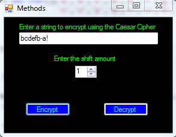

C# Basics - Methods
===================

## Introduction

C# is an Object Oriented Programming (OOP) language.  It shares concepts with many other programming languages.  One of the basic concepts is methods.  A method is a group of instructions.  It's a way to group parts of code that perform an action.  You can also perform the action multiple times or in different parts of the program without rewriting the same code.  This way, you break the problem down into smaller steps.  Instead of worrying how to solve the entire problem at once, you can solve smaller parts of the problem and then combine those solutions.

While it might be possible to write an entire program without methods, this becomes very difficult to follow, debug, and even implement as the program gets more complex.  It's a best practice to group functionality into methods, especially as they can be called from other classes.  This is covered after the walkthrough.  For more information, view the [Classes](classes.md) walkthrough.

Methods can have "parameters", which are ways of customizing the code you wrote.  One time, you might want to add 4 to a number.  The next time, you might want to add 5.  Using a parameter, you can specify this number but still use the same code.

Before you start writing code, you need to understand the problem and how to solve it.  When using that approach, the code should be trivial.

The steps below will create a basic Windows Forms application.  It will take a user-entered word or sentence, and encrypt it using the [Caesar Cipher](https://en.wikipedia.org/wiki/Caesar_cipher).  It will also decrypt it using the same method.


## Steps

1. Open Visual Studio and create a new Windows Forms application.  For details on how to do this, please see the [Creating a Basic Application](getting-started-with-dotnet.md) walkthrough.

    
 
2. Set the Form's title text to "Methods".  Do you remember how to do this?  (Hint: check the properties window.)

    
 
3. Next, add a TextBox, a NumericUpDown, two Label controls, and two Button controls from the "Common Controls" section of the toolbox.  After the controls are added, set the following properties in the properties window.

	a. Set the Name of the TextBox control to "txtMessage".
	
	b. Set the Name of the NumericUpDown control to "numStep".
	
	c. Set the Name of the first Button to "btnEncrypt".
	
	d. Set the Name of the second Button to "btnDecrypt".
	
	e. Set the Text of the first Button to "Encrypt".
	
	f. Set the Text of the second Button to "Decrypt".
	
	g. Set the Text of the first Label to "Enter a string to encrypt using the Caesar Cipher".
	
	h. Set the Text of the second Label to "Enter the shift amount".
	
	i. Set the Maximum on the NumericUpDown to 25.  We could easily enter code to modulo any invalid values, but let's keep it simple like this.

4. Arrange the controls as in the screenshot below.  Also, feel free to customize the appearance, as explained in the [basic walkthrough](getting-started-with-dotnet.md).

    

5. We will add the functionality for the click events of both buttons in the code-behind.  Double-click the Encrypt and Decrypt buttons to generate the event handlers.  We'll leave these alone for now, but we'll need them later.

	```
	private void btnEncrypt_Click(object sender, EventArgs e)
	{
	
	}
	
	private void btnDecrypt_Click(object sender, EventArgs e)
	{
	
	}
	```
 
6. The goal is to encrypt the entered message by the given shift amount.  Think about how to solve the problem by breaking it down into easier steps.  Hint: we will use a method to achieve this, and then call it in the button's event handler.  What would this method do?  Another goal is to be able to reuse the same method for both encryption and decryption.  What parameters would it take to allow that?  Think about it, and then continue.

	a. Let's leave the button's click event handler alone for now.

	b. Create a method stub for handling the string transformation.  The basic idea is to convert a string to a character array, and then shifting each character.

	To do this, we should accept 2 parameters.  One is the string to shift, and the other is the amount by which to shift each character.
	
	```
	private string Transform(string message, int step)
	{
	}
	```
 
	Let's take a look at the method signature.  First, the method says "private", which means it can’t be used by just anyone.  This is important when using classes.  This is covered in more detail after the walkthrough.  For more information, please refer to the [Classes](classes.md) walkthrough.

	Next comes the return type, string.  This means that after all the work is done, the result will be a string and it needs to be used in a "return" statement.  Based on the code snippet above, the Transform method doesn't return a string yet, and that will cause an error in Visual Studio.  It doesn’t do anything yet, but this will be fixed as we add the functionality to the method.
	
	The next item is the name, which is "Transform".  You can choose almost any name you want, but it should describe what the method does.
	
	Finally, there are the method arguments.  These are the customizable parts of the method.  Here we let the method know which string to shift, and by how much to shift it.
	
	c. In order to be able to shift the letters, we’ll need to know the numeric values associated with them.  How do you think we could implement this?  Think about it, and then continue.
	
	We could use an array and have the index match the numeric value of the letter (with a being 0, b being 1, etc.).  Let’s declare that array in Form1.  This could also be declared in the Transform method, because it’s only used in that part of the program.  My example puts it above the Form1 constructor.
	
	```
char[] letters = new char[]{'a','b','c','d','e','f','g','h','i','j','k','l','m',                                    'n','o','p','q','r','s','t','u','v','w','x','y','z'};
	```
 
	This is a character array.  In C#, characters need to be enclosed in single quotes, and strings use double quotes.  Note how the array of the index will correspond to the number of the letter, with 'a' starting at 0 and 'z' being 25.
	
	d. Next, let's convert the string in the method parameter into a character array, so that we can do operations on each character individually.
	
	```
	private string Transform(string message, int step)
    {
        char[] newMessage = message.ToLower().ToCharArray();
    }
	```
 
	Note that this also converts the string to lower case, so that capital letters are not ignored.
	
	e. Get the length of the message so we know how many times we need to try to encrypt a letter.
	
	```
	int length = message.Length;
	```
 
	f. Now that we have the length of the string, we can use a for loop to cycle through the letters in the character array, and shift each one. 

	```
	for (int i = 0; i < length; i++)
    {
        char letter = newMessage[i];
        int index = Array.IndexOf(letters, letter);
        if (index >= 0)
        {
            newMessage[i] = letters[(index + step) % 26];
        }
    }
	```
 
	This requires some explanation.  The basic for loop goes from 0 to 1 less than the length, which should be easy to understand.
	
	Next, we get the letter from the string at that index, starting at 0.  Then we figure out where it is in the letters array – meaning the numeric value of the letter, from 0 to 25.  If that letter exists in the array, meaning that the value will be greater than or equal to 0, then shift it based on the "step" parameter, which is the number of letters to shift it.  It ignores any characters that are not in the "letters" array, like punctuation and spaces.
	
	The shift adds the step value to the index of the letter, and then takes the remainder after dividing by 26.  This is done so that the letters loop around after passing 'z'.  For example, if we have the letter 'y' and we shift it by a step of 2, then it would be `24 + 2 = 26`, which is outside of the array bounds!  Remember, the array indices go from 0 to 25!  The modulo (`%`) operator provides the remainder, which in this case would be 0.
	
	g. Finally, we need to return a string as promised in the method declaration.
	
	```
	return new string(newMessage);
	```
 
	This is simply creating a new string out of the character array that we were manipulating.  We can’t return a character array – it's not the same thing as a string.
	
	The full method code looks like this.
	
	```
	private string Transform(string message, int step)
    {
        char[] newMessage = message.ToLower().ToCharArray();
        int length = message.Length;

		for (int i = 0; i < length; i++)
        {
            char letter = newMessage[i];
            int index = Array.IndexOf(letters, letter);
            if (index >= 0)
            {
                newMessage[i] = letters[(index + step) % 26];
            }
        }

        return new string(newMessage);
    }
	```
	
7. Now let's get back to the two button click events.  We have to make the buttons do this transformation. Remember, we already did the hard work in creating the method.  Now let's call it with the correct parameters!

	```
	private void btnEncrypt_Click(object sender, EventArgs e)
    {
        txtMessage.Text = Transform(txtMessage.Text, (int)numStep.Value);
    }

    private void btnDecrypt_Click(object sender, EventArgs e)
    {
        txtMessage.Text = Transform(txtMessage.Text, ((26 - (int)numStep.Value) % 26));
    }
	```
 
	To encrypt the message, we simply take the text from the TextBox control, and we take the value of the NumericUpDown control as an integer.  Remember that the range we set on the NumericUpDown control is 0 to 25, so the step will be positive and within a reasonable range.

	To decrypt the message, we send in the same string, but go backwards with the shift.  Negative numbers don't work as expected with modulo (`%`) in C#, so instead we can use 26 minus the step, and modulo that just to make sure it is a valid step value, in case the step is 0.

8. Save and run the project.  Enter a string and a step, and then encrypt and decrypt it!

	Original:
	
	
	
	Encrypted:
	
	
	
	Decrypted:
	
	
 
## Why Use Methods?

In the walkthrough, the "Transform" method could have been copied and pasted into the individual button click events, although this would have duplicated code.  Imagine if you had to make a change to the logic.  Then you'd have to remember to make it in 2 places, or you'd have a bug.  It's easier to just have it in 1 method and call the method twice.  You could say that this is a "best practice" but it just makes sense!  The same could be applied to a scenario where you have 9 buttons that all do the same thing – why write the code 9 times when you can write it once?

It breaks up the code into understandable parts.  I can easily see that the Encrypt and Decrypt buttons are doing almost the same thing –using different parameters for the same method.  I only have to write the method once.  This is especially important for other people looking at your code, or if you inherit someone else's code!  Why should you have to compare blocks of code line by line to tell if they are the same?

It allows for easy code re-use.  No more copying and pasting the same code into multiple parts of the program.  Not only does this make the code easier to read and shorter, but it also makes it more stable because you have less to maintain.

It helps with debugging.  If something is wrong with how the string is getting encrypted or decrypted, the problem can be narrowed down to either the calls to the Transform method, or the Transform method itself.

It allows the same code to be used with different values.  The parameters in the walkthrough allow us to use the same Transform method to do both encoding and decoding, by changing the step parameter.
