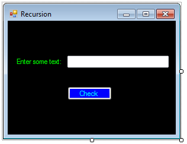

C# Basics - Recursion
=====================

## Introduction

C# is an Object Oriented Programming (OOP) language.  It shares concepts with many other programming languages.  Recursion is an advanced concept, but allows for complex issues to be solved simply with very little code.  There are two parts to any recursive solution – a "base case" and the "recursive step".  The "base case" is one where you have solved the problem completely.  The "recursive step" is where the problem is simplified and retried.  As such, you continually advance toward a solution until the "base case" is hit.

Before you start writing code, you need to understand the problem and how to solve it.  When using that approach, the code should be trivial.

Recursion will be shown first with strings, where a string will be checked to see if it is a palindrome (reads the same both forwards and backwards).  The challenge for the reader will be to compute a factorial (`x! = x * (x – 1) * (x -2) * (x – 3) … * 1`).

The steps below will create a basic Windows Forms application.  It will ask for a string input, and then check if that string is a palindrome.

## Steps

1. Open Visual Studio and create a new Windows Forms application.  For details on how to do this, please see the [Creating a Basic Application](getting-started-with-dotnet.md) walkthrough.

    
 
2. Set the Form's title text to "Recursion".  Do you remember how to do this?  (Hint: check the properties window.)

    
 
3. Next, add a TextBox control, a Label control, and a Button control from the "Common Controls" section of the toolbox.  After the controls are added, set the following properties in the properties window.

	a. Set the Name of the TextBox control to "txtString".
	
	b. Set the Name of the Button to "btnCheck".
	
	c. Set the Text of the Button to "Check".
	
	d. Set the Text of the Label to "Enter some text:".
	
	It's a best practice to set the names of any controls you will reference in the code-behind.  Outside of theory, it makes it a lot easier to refer to a button as "submitButton" than as "button1", especially if you have multiple buttons.

4. Arrange the controls as in the screenshot below.  Also, feel free to customize the appearance, as explained in the [basic walkthrough](getting-started-with-dotnet.md).

    

5. We will add the functionality for the button click in the code-behind.  Double-click the button to generate the event handler.

	```
	private void btnCheck_Click(object sender, EventArgs e)
    {

    }
	```
 
6. The goal is to check if the entered string is a palindrome.  How do we do that?

	Let's start by getting the value entered.  If you need a hint, check the [Variables](variables.md) walkthrough.  This code goes inside the button click event handler.

	```
	String text = txtString.Text; 
	```
	
7. We will leave the button click event handler alone for a while.  We have to create a new method to allow the recursion to work.  This is done because the basis of recursion relies on calling the same method multiple times.  If we don't create a method, we have nothing to repeat!  For now, just create a blank method (outside of the event handler) and name it something that describes the function it has, checking for a palindrome.  For more information on methods, please see the [Methods](methods.md) walkthrough.

	```
	private void isPalindrome(String text)
    {

    }
	```

8. Now we will add code to the method you just created.

	Create the base case.  What are the two simplest strings (series of characters) that you can think of that read the same forwards and backwards?  Please think about it, and continue when you're ready.
	
	The first one is the empty string, meaning, no characters, no text.
	
	The second one is a single character, like 'a'.
	
	Let's check for these base cases.  For more information about if statements, please read the [If Statements and For Loops](if-statements-and-for-loops.md) walkthrough.

	```
	if (text.Length == 0 || text.Length == 1)
	{
		MessageBox.Show ("Yes, " + txtString.Text + " is a palindrome!");
	}
	```
 
	`||` is the "or" operator.  The "if" statement checks if the length is 0 OR if the length is 1.  It's not used here, but the "and" operator is `&&`.

9. Now that we know what the base cases are, if the given string is more complex, we have to simplify the problem.  How do you check if a string is a palindrome?  Where would you start?  What is the first comparison you would do?

	Let's check if the first and last characters match.  We don't care about the rest of the string for now.  The key to solving many seemingly complex issues is to take things one step at a time.  This code goes below the code in the previous step.
	
	```
	else if (text[0].Equals(text[text.Length – 1]))
	{
		// recursive step
	}
	else
	{
		MessageBox.Show("No, " + txtString.Text  + " is not a palindrome.");
	}
	```
 
	This compares `text[0]`, which is the first letter in the string, with the `text[text.Length – 1]`, which is the last letter in the string.  In programming, indices are 0-based, meaning that you start counting at 0.  The "first" letter is "index 0", and if there are 5 letters in the word, the last letter is "index 4".

	If the letters do not match, then it is not a palindrome.

10.	Here comes the recursive step.  What do we do if the first and last letters match?  We have to compare the rest of the string, right?  Don't panic!  This is not as difficult as it sounds.  We already have all of the logic implemented for checking if a string is a palindrome.  We just need to reuse that logic.  We've already confirmed that the first and last letters match.  We can call our method again using the part of the string we haven't checked yet.  Instead of using the full string that was entered, we'll use everything except the first and last characters.  Add this code where we wrote the comment `// recursive step`.

	```
	isPalindrome(text.Substring(1, text.Length – 2));
	```
 
	This calls the isPalindrome method again, using only the text from index 1 (the second letter) to the second to last letter.

11.	The last thing to do is to call the method isPalindrome in the button click event handler.  This gets it all started!  Provide the full text that was entered.
	
	```
	isPalindrome(txtString.Text);
	```

12. For your reference, here is the full code.

	```
	private void btnCheck_Click(object sender, EventArgs e)
    {
        isPalindrome(txtString.Text);
    }

    private void isPalindrome(String text)
    {
        // base case - empty string and 1 character are both palindromes
        if (text.Length == 0 || text.Length == 1)
        {
            MessageBox.Show("Yes, " + txtString.Text + " is a palindrome!");
        }
        else if (text[0].Equals(text[text.Length - 1]))
        {
            // recursive step
            isPalindrome(text.Substring(1, text.Length - 2));
        }
        else
        {
            MessageBox.Show("No, " + txtString.Text + " is not a palindrome.");
        }
    }
	```

13. Save and run the project.  Enter a string and click "Check".

	
	
	
	
	
 
## Challenge

As mentioned in the introduction, the challenge exercise is to calculate a factorial of a number.

A factorial (`!`) is defined mathematically as follows:

```
x! = x * (x – 1) * (x -2) * (x -3) … *1 
```

This means you multiply the number, x, by every integer less than it, down to 1.

For example:

```
3! = 3 * 2 * 1 = 6
5! = 5 * 4 * 3 * 2 * 1 = 120
```

Can you use the same recursive ideas to accomplish this?

What is the base case?  This is tricky, so I'll give you half of the answer.  There are 2 base cases.  The first one is 0.  `0! = 1`.  The factorial of 0 is 1.  What is the other base case?

What do you do before taking the recursive step?  How do you "simplify the problem"?

When you take the recursive step, what do you pass into your method?
