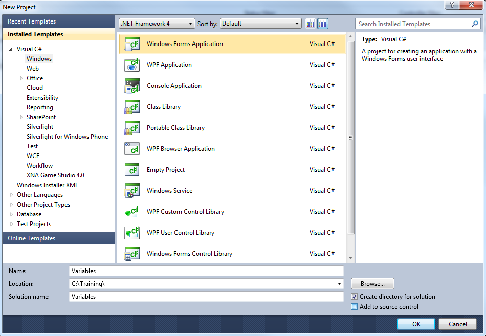
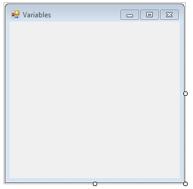
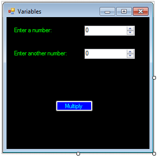
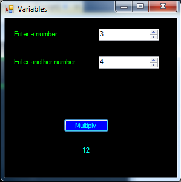

C# Basics - Variables
=====================

## Introduction

C# is an Object Oriented Programming (OOP) language.  It shares concepts with many other programming languages.  One of the basic concepts is variables.  A variable is a way to store some piece of data.  As the name suggests, that data may change.  "[Strongly typed](https://en.wikipedia.org/wiki/Strong_and_weak_typing)" languages, like C#, require variables to have a certain type, like a number or text.  This way, the program knows how to handle them.

Before you start writing code, you need to understand the problem and how to solve it.  When using that approach, the code should be trivial. 

The steps below will create a basic Windows Forms application.  It will multiply two numbers and show the result.

## Steps

1. Open Visual Studio and create a new Windows Forms application.  For details on how to do this, please see the [Creating a Basic Application](getting-started-with-dotnet.md) walkthrough.

    
 
2. Set the Form's title text to "Variables".  Do you remember how to do this?  (Hint: check the properties window.)

    
 
3. Next, add two NumericUpDown controls, three Label controls, and a Button control from the “Common Controls” section of the toolbox.  After the controls are added, set the following properties in the properties window.

	a. Set the Name of the first NumericUpDown control to "numVariable1".
	
	b. Set the Name of the second NumericUpDown control to "numVariable2".
	
	c. Set the Name of the Button to "btnMultiply".
	
	d. Set the Text of the Button to "Multiply".
	
	e. Set the Text of the first Label to "Enter a number:".
	
	f. Set the Text of the second Label to "Enter another number:".
	
	g. Set the Name of the third Label to "lblResult".
	
	h. Set the Text of the third Label to "" (empty string) to clear the text.

	It’s a best practice to set the names of any controls you will reference in the code-behind.  Outside of theory, it makes it a lot easier to refer to a button as "submitButton" than as "button1", especially if you have multiple buttons.

4. Arrange the controls as in the screenshot below.  Also, feel free to customize the appearance, as explained in the [basic walkthrough](getting-started-with-dotnet.md).

    
	
	Note that "lblResult" should be placed below the button.  It doesn't have any text set yet, so it won't show up in the designer unless it's selected.

5. We will add the functionality for the button click in the code-behind.  Double-click the button to generate the event handler.

	```
	private void btnMultiply_Click(object sender, EventArgs e)
	{
	
	}
	```
 
6. How would you multiply two numbers?  Remember, we have to solve the problem first before we can write any code!

	We want the button click to show the result of multiplying the two entered numbers in the third label.  Any ideas?
	
	Remember, this is a walkthrough about "variables".  Think about it!  When you’re ready and you have an idea, continue reading.

	a. Create a variable to store the result of the entered numbers.  Let’s call it "result".  It’s going to be a number.  Normally the type would be "int" (for integer), but the NumericUpDown controls allow decimals, so the type is "decimal".

	b. To get the result of multiplying the two numbers, we need to multiply them!  The numbers come from the value of the two NumericUpDown controls.

	c. Use `*` to multiply, and `=` to assign the result to the variable.

	```
	decimal result = numVariable1.Value * numVariable2.Value;
	```

	d. All that’s left is to show the result on the form.  Set the Text property of the third Label control to the result.  The result is a decimal, because the NumericUpDown controls use the decimal type by default.  When declaring the variable to hold the result, its type must match the type of the value assigned.  For more information, please see the "Detailed Explanations" section below.  Labels show the string type, so telling it to show a decimal won’t work.  Luckily there is already a converter method!

	```
	lblResult.Text = result.ToString();
	```
	
	The full event handler code is as follows.
	
	```
	private void btnMultiply_Click(object sender, EventArgs e)
	{
	    decimal result = numVariable1.Value * numVariable2.Value;
	    lblResult.Text = result.ToString();
	}
	```
 
7. Save and run the project.  Enter two numbers and click "Multiply".

    
 
## Detailed Explanations

### About Types

The most common types are "int" (integer number) and "string" (text).  Other basic types include "char" (one character), "bool" (Boolean, true or false), and "decimal" (allowing for non-whole numbers with a decimal point).  For more information about the basic types available in C#, please reference [this article on MSDN](https://msdn.microsoft.com/en-us/library/ya5y69ds.aspx).

When you declare a variable, you need to specify its type.  We use "decimal" here in the walkthrough because that's what the Value property of the NumericUpDown uses.  This is a Microsoft-provided control, and that’s simply how it was created.  Similarly, TextBox.Text will use "string", even if you enter a number.

To get around this, there is something called "casting", which means you change one type to another by explicitly telling the program to change the type.  You would do it by putting the desired type in parentheses ahead of the code that accesses the actual type.  This is a bit complex for the walkthrough, so we use decimal instead.

```
int result = (int) numVariable1.Value;
```

Many types, like decimal, have a built-in ToString() method, which converts the value to a string type.  It's easier to go from a number to a string, because all numbers should be displayable as text.  Conversely, it's harder to make sure that text is actually a number (imagine if there was "asdf" entered and you told the program to make that into a number).

### About Accessing Elements On The Form

In this example, the values from the NumericUpDown controls were used.  These were accessed using code.  The pattern is as follows.

```
[name of element on form].[property you want to use]
```

With this data, you can either "get" or "set" it.  "Get" means you simply read what the value or text is, without changing it.  "Set" means you change the value.

We did both in this example.  The multiplication operation had to **get** both of the numeric values.  It **set** the value of the variable we created to hold the result.

```
decimal result = numVariable1.Value * numVariable2.Value
```

Another example of **setting** a value is where we changed the text of the third Label control.

```
lblResult.Text = result.ToString();
```

If you would like to explore the controls and what properties they have available, this can be done in one of 2 easy ways.

1.	You can click on the control in the designer, and view the Properties window on the right side.  If it is not showing, you can right-click the control in the designer and choose "Properties", which should show this window.  There, all of the available properties will be listed, along with descriptions.

2.	In the code-behind, you can type the name of a control you have on the designer (ex. lblResult), followed by a ".".  If you do that, it should bring up what is called "intellisense".  It will give you a list of the possible properties, along with their types and descriptions.

### About Assigning Values

One confusing concept is that the `=` sign does not actually mean "equals" in C# and many other programming languages.  It means "is assigned the value" of whatever follows it.

```
int simpleMult = 3 * 3;
```

In that example, the integer variable "simpleMult" is given the value of the result of the multiplication `3 * 3`.

The way to check for equality is to use `==`, just in case you’re curious.  This will come up when using if statements and for loops, which are covered in a future topic.

## Challenges

If you want to do more with variables, try the following challenges!

* Start from the walkthrough application.  No matter what the user enters in the form, ignore one of the numbers and always use the number "10". (Hint: create a decimal variable set to 10 and use that in math operation instead of one of the values.)
* Create a new application with a text field for the user's name.  After clicking the button, display a welcome message, using the given name.
* [Advanced] Create a new application with a text field for any text.  After clicking the button, display just the first letter of the entered text.
* [Advanced] Create a calculator with two editors and buttons for the 4 simple operations (`+`, `-`, `*`, `/`).  Basically, the user enters two numbers similar to what we did in the walkthrough, and then chooses the operation by clicking on the button.  Beware of dividing by 0!
